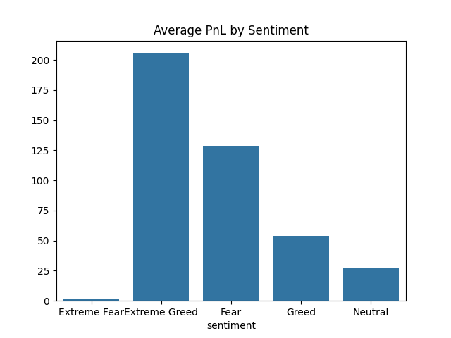
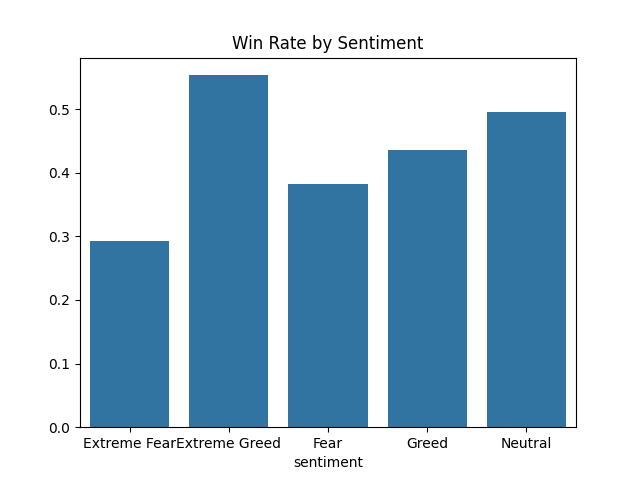
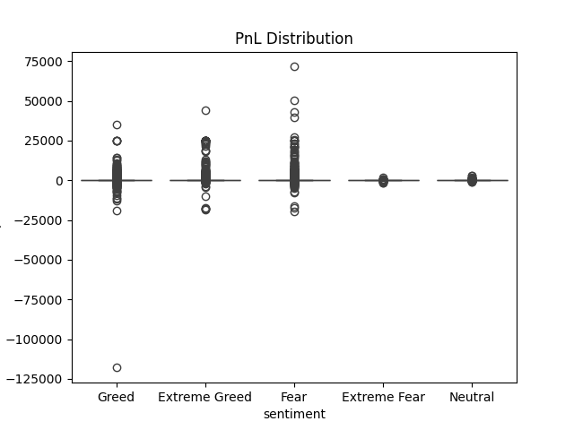
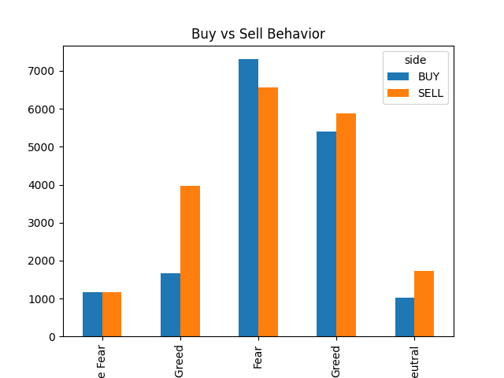

Sentiment Trading Analysis

Overview

This project analyzes how market sentiment (Fear vs Greed) affects trader performance.

The aim is to understand whether traders perform better during Fear or Greed market conditions, and how sentiment influences their trading behavior.

---

Objective

The main goals of this project are:

- Compare trader performance in Fear vs Greed
- Analyze how sentiment affects:
  - Profit (PnL)
  - Win rate
  - Risk-taking behavior (leverage)

---

Dataset Used

I used two datasets:

1. **Trading Data**

   * Contains trade details like profit, side, leverage, etc.

2. **Fear & Greed Data**

   * Contains daily market sentiment (Fear or Greed)

Due to file size limitations, the full dataset is not included in this repository.

You can download the datasets from the original sources:
 Historical Data : https://drive.google.com/file/d/1IAfLZwu6rJzyWKgBToqwSmmVYU6VbjVs/view?usp=sharing


 Fear Greed Index link : https://drive.google.com/file/d/1PgQC0tO8XN-wqkNyghWc_-mnrYv_nhSf/view?usp=sharing


---

What I Did

- Loaded both datasets using Python
- Cleaned the data (fixed column names, handled missing values)
- Converted time column into date format
- Merged datasets based on date
- Performed analysis on:
  - Average profit
  - Win rate
  - Leverage usage
- Created visualizations to understand patterns


---

Machine Learning Extension

To extend the analysis, a simple Machine Learning model (Logistic Regression) is used.

- The model predicts whether a trade will be profitable (win or loss)
- Uses features like:
  - Market sentiment
  - Leverage (if available)

This shows how data analysis can be extended into AI-based prediction.

---

Results

From the analysis:

- Traders tend to earn higher profit during Fear periods
- Win rate is also higher during Fear
- During Greed, traders use higher leverage
- Higher risk-taking during Greed often leads to lower profitability


---

Insights

- Traders behave more carefully during Fear
- Traders take more risks during Greed
- Market sentiment directly impacts trading performance

---

Strategy Suggestion

- Consider trading during Fear periods
- Avoid excessive leverage during Greed
- Always apply proper risk management

---

Tools Used

- Python
- Pandas
- Matplotlib
- Seaborn
- Scikit-learn


---

How to Run

```bash
pip install pandas matplotlib seaborn scikit-learn 
python sentiment_trading_analysis.py
```

---

Screenshot






---

Conclusion

This project shows that market sentiment has a strong impact on trader performance.

By combining data analysis with a simple machine learning model, we can better understand and predict trading behavior.

---

Author

Ardra k

